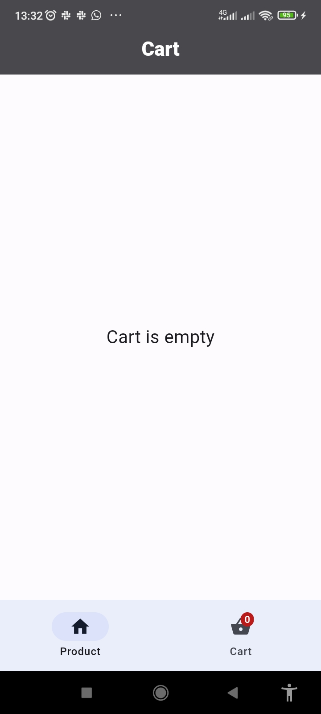
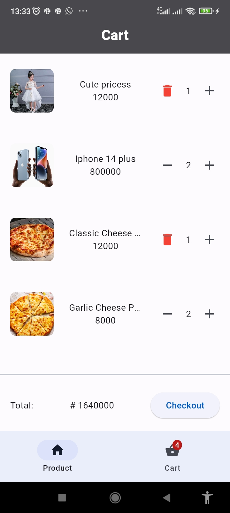
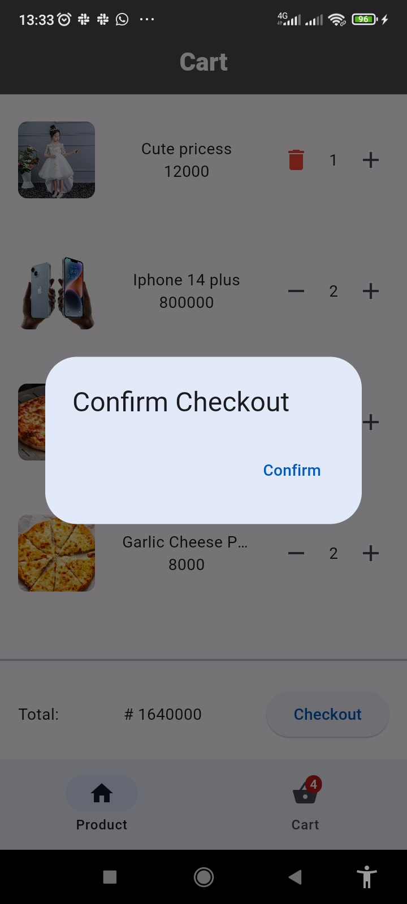

# Simple Shopping App

A simple flutter shopping application using static data

## Features

- View a list of products
- Add products to cart
- Remove products from cart
- increase and decrease product quantity in cart
- checkout functionality

## Screenshots






## Setup Instructions

To run this project locally, follow these steps

1. clone the repository:

```bash
    git clone https://github.com/lurldgbodex/HNG.git
```

2. Navigate to the directory

```bash
cd mobile/simple_shopping_app
```

3. install dependencies

```bash
flutter pub get
```

4. Run the app

```bash
flutter run
```

5. Build APK
   flutter build apk

## Download APK

you can download the APK for this application from [here]()

## Dependencies

The project uses the following dependencies:

- `flutter`
