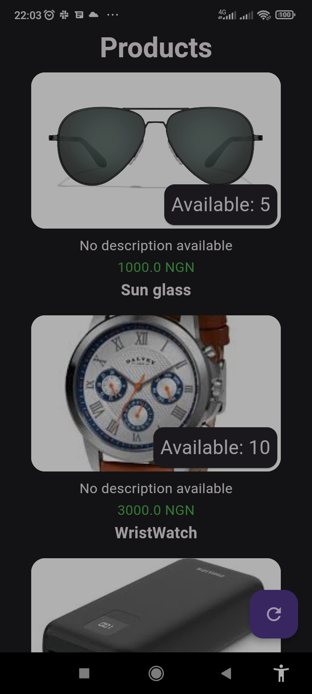
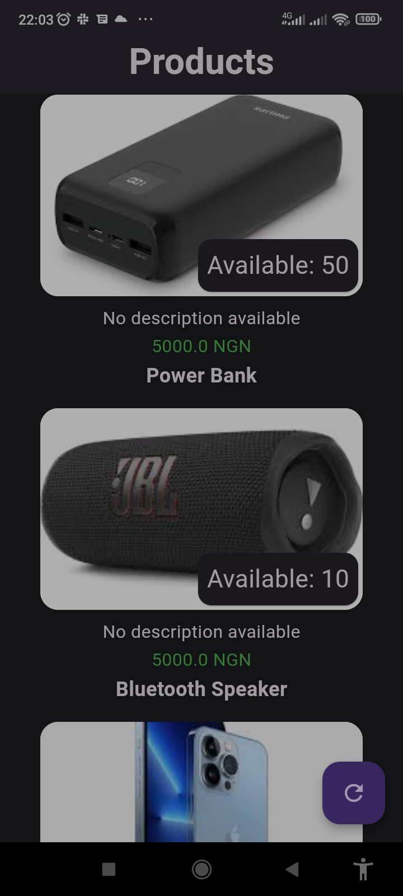
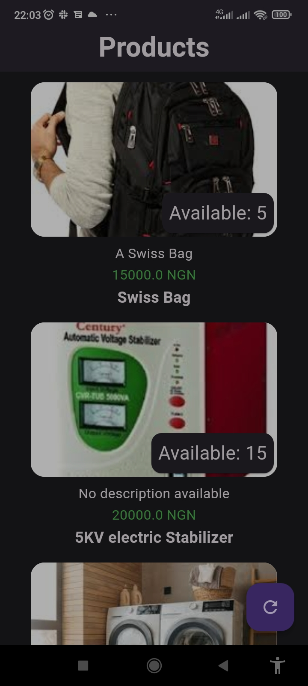

# Timbu

A new flutter application implementing Timbu api;

## Features

- List products and its associated data

## Screenshots





## Setup Instructions

To run this project locally, follow these steps

1. clone the repository:

```bash
    git clone https://github.com/lurldgbodex/HNG.git
```

2. Navigate to the directory

```bash
cd mobile/timbu
```

3. install dependencies

```bash
flutter pub get
```

4. Run the app

```bash
flutter run
```

5. Build APK
   flutter build apk

## Download APK

you can download the APK for this application from [here](https://github.com/lurldgbodex/HNG/releases/download/v1.1.0/app-release.apk)

## Dependencies

The project uses the following dependencies:

- `flutter`
- `Dio`
- `Flutter_bloc`
- `Equatable`
- `Flutter_dotenv`
